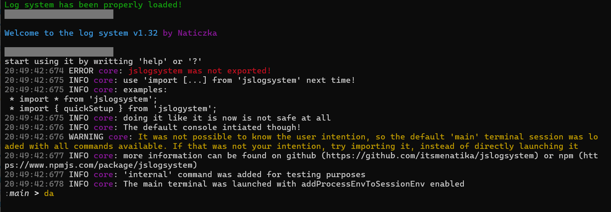
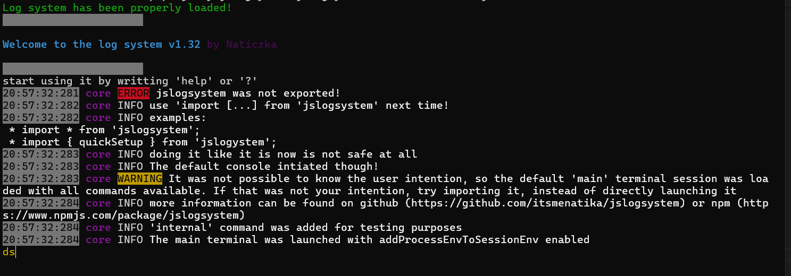
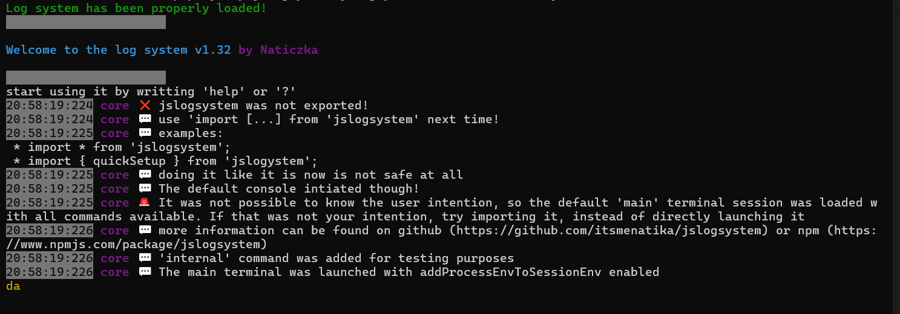

# jslogsystem

[](./LICENSE)
[](./CONTRIBUTING.md)
[](#)
[](#)
[](https://www.npmjs.com/package/jslogsystem)
[](https://github.com/itsmenatika/jslogsystem)
[](#)
[](https://www.typescriptlang.org/)


> [!NOTE]
> For migrating from 1.2.7 check THERE

**What is it?**

jslogsystem is quick plug-in javascript (also supports typescript and it is written in typescript) module that handles logging and CLI for you

Most notable features are:
* logging (since 1.0)
* terminal sessions (since 1.3)
* pipes (since 1.2)
* user binds (since 1.14)
* built-in commands and possibility of adding your own commands (since 1.0)
* styles (it's properly supported since 3.2 and partially since 3.0)

## how to use

You have to create a terminal session<sup>[1]</sup> using one of available functions, for example: **quickSetup()**. That function creates 'main' terminal that will be used as an entry point.

example code:
```js
import { quickSetup } from "jslogsystem";

quickSetup();

```

and that's it, that is the simplest way to start up.


You can now type your commands and click enter to send them
also:
* CTRL + C will exit the logsystem
* CTRL + X will print the special character
* CTRL + B will go to the left on the session list
* CTRL + N will go to the right on the session list
* CTRL + M will send the command without enter

write 'help' for the list of currently available commands!
by the default, you have an access to all of them!

## multiple sessions

More sessions can be created using 'terminal' command or by using terminalApi.

example:
```terminal new cute -a``` will create a new terminal will all commands named 'cute'

you can then switch to that terminal using ```terminal switch cute```


js:
```javascript

terminalApi.create("cute", {
    config: {
        commandTable: allGroup_collection
    }
});
```
It is equal to the first command


Terminal sessions can have different styles or even different commands.

## pipes:

you can combine commands using pipes:
* | <- redirect the result of previous command into a new one
* && <- execute the next command if the result of a previous command was positive and redirect that result
* || <- execute the next command if the result of a previous command was negative and redirect that result
* ; <- starts a new command chain independent of the previous chain
* \> <- save the result to a file
* \>\> <- append the result to a file
* < <- get the result from a file and pipe it to command before that

If you want to just write that character and you don't want to use pipes use either quotas ("|") or a escape character (\|).
Those things are parsed entirely by a command interpreter and will not be passed into commands

## special character (§)

You can get it either by clicking CTRL + X or by writting \$.

That character has special uses mostly used by commands

Commands may interpret that special characters differently


Its purpose is to shorten commands by not using long escape sequences

## styles

The package offers a few styles:


DEFAULT


MINECRAFT


CLEAN


CLEAN SIGNS

### how to add them?

example code:
```js
import { quickSetup, STYLE_CLEANSIGNS } from "jslogsystem";

quickSetup(
    {
        styles: STYLE_CLEANSIGNS
    }
);
```

## user binds

Users can create binds using 'bind' command. For more information use: '? bind'

## how to properly log?

We recommend just getting a consoleShortHand that will ease everything for you

get it by using
```javascript
    const shortHand = getNewConsole();
```

you can also provide one argument saying which session it belongs to as such:
```javascript
    const shortHand = getNewConsole("cute");
```

## Related

* [chalk](https://www.npmjs.com/package/chalk) -> Terminal string styling done right. It allows you to easily format strings in a specified color. It supports nested colors. It may become a depedency in the future. It currently not required
* [fahs-jslogsystem](https://www.npmjs.com/package/fahs-jslogsystem) -> an addon that adds an alternative to default 'inspect'
