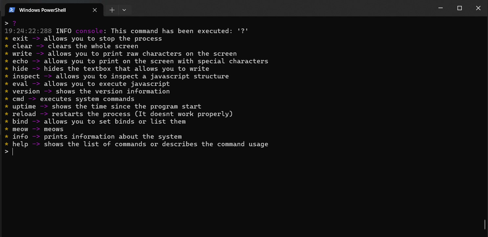
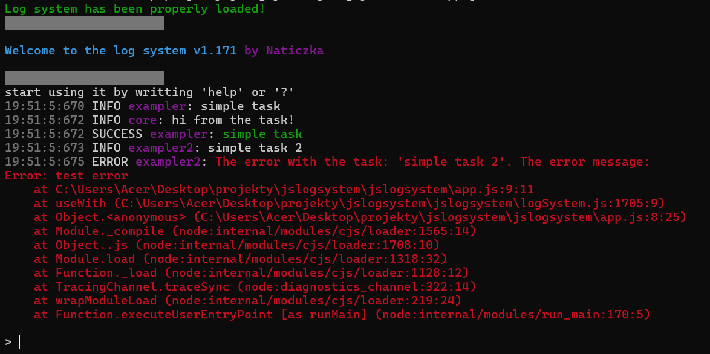

# what is this?

It's a interactive javascript console designed to ease managing your projects. It's a runtime only.


This is an example of running "?" command

The console has a lot of built in commands ready to use.


# how to set up?

You can see an example of setting it up [THERE](./app.ts). It supports both typescript and javascript, but typescript is recommended as it was written in it.

You can't use any other thing that manipulates STDIN, STDOUT or STDERR (at least for now, we'll see in the future!) with that console.

by importing [TS](./logSystem.ts)/[JS](./logSystem.js)/[MINJS](./logSystemMIN.js) you automatically start up the console.

example:
```ts
import { keepProcessAlive } from "./logSystem";

keepProcessAlive();
```

keepProcessAlive keeps the process alive, even though there's no code.

you can also use:
```js
	const logSystem = require("./logSystem.js");

	logSystem.keepProcessAlive();
```

# how to use?

There's a few things that you may want to import:
* newConsole -> complete API replacement for native NODE.js console with new features (COLORS!)
* replaceConsole -> replaces global "console" (node native) with full compatible newConsole
* keepProcessAlive -> keeps the process alive, even though there's no code. Don't use if there's code!
* useWith -> error wrapper, to ease loging logs. It works like catch-try block but with auto logging
* registerCommand -> api for registering commands. It also available under newConsole.commands
* registerCommandLegacy -> legacy version (for 1.0) of registerCommand
* multiCommandRegister -> used for programs that want easily add a lot of commands with one call
* actualCrash / ac -> api for crashing program
* versionInfo -> set your own information info displayed in "version"
* getCurrentVersionOfLogSystem -> prints the current version of logSystem
* logNode class -> used for keeping track of log tree (you can set nodes, so you can have like: server.player.meow.inventoryHandler, etc)
* setLegacyInformation -> to manage legacy stuff (not recommended, unless you want to support things that are deprecated!)

# sumarizing...

It's very easy to use and creating a whole documentation for that small thing would be a huge waste of time. But maybe i'll create one in the future


few examples for the end

##printing few logs

```ts
import { keepProcessAlive, replaceConsole } from "./logSystem";

replaceConsole();

console.time("start");

console.log("hii! How are you?");
console.error("ERROR!");

// typescript doesnt like that comparision xd
// @ts-expect-error
console.assert(2 == 3, "2 is not equal to 3!");

console.group("meowGroup");

console.log("hi from the group!");

console.groupEnd();

console.count("s");

console.log("test");

console.count("s");

console.timeEnd("start");


keepProcessAlive();
```

will produce that result:


## using useWith

```ts
import { keepProcessAlive, replaceConsole, useWith } from "./logSystem";

replaceConsole();

useWith("simple task", () => {
    console.log("hi from the task!");
}, "exampler");

useWith("simple task 2", () => {
    throw Error("test error");
}, "exampler2");

keepProcessAlive();
```
will produce that result:



## using logNode and registering commands

```ts
import { keepProcessAlive, logNode, newConsole, replaceConsole, useWith } from "./logSystem";

replaceConsole();

newConsole.commands.registerCommand("testcmd", {
    callback: (args: string[]): boolean => {
        console.log(":3");

        const par = new logNode("ultraparent");

        // INFO: FOR COMPATIBILITY PURPOSES, YOU CANT USE IT WITH newConsole/console.log!
        // console.log according to standard should take ...string[] ! and we can't change that!

        newConsole.info("hii!", par);
        
        return true;
    }
});

keepProcessAlive();
```

> [!WARNING]  
> the return type for that will be extended in the future! It currently serves no purpose, but it's kept for compatibility reasons! Boolean type was used to indicate whether the command has written anything to screen

will produce that result:


